# unillm — Complete Design & Implementation Specification

> **Purpose:** the single source of truth for building `unillm`. An implementing agent with a
> fresh context (no conversation memory) should be able to build the entire system from this
> document alone.
> **Level of detail:** contracts, schemas, wire formats, endpoint specs, algorithms, and
> schemas — **not** implementation source code. Where logic is non-obvious it is described as
> numbered steps / decision tables, not code.
> **Status:** design complete.

---

## Table of Contents

0. [Executive Summary](#0-executive-summary)
1. [Goals, Non-Goals, Principles](#1-goals-non-goals-principles)
2. [Provider Landscape — Complete Wire Formats](#2-provider-landscape--complete-wire-formats)
3. [System Architecture](#3-system-architecture)
4. [Canonical IR — Complete Contract](#4-canonical-ir--complete-contract)
5. [Provider Adapters — Complete Mapping](#5-provider-adapters--complete-mapping)
6. [Streaming Protocol — Complete](#6-streaming-protocol--complete)
7. [Cache Control — Complete](#7-cache-control--complete)
8. [Tool Use & Multi-turn — Complete](#8-tool-use--multi-turn--complete)
9. [SDK (`unillm`) — Complete API](#9-sdk-unillm--complete-api)
10. [Proxy (`unillm-proxy`) — Complete](#10-proxy-unillm-proxy--complete)
11. [Storage — Complete Schema](#11-storage--complete-schema)
12. [Rate Limiting & Concurrency — Complete](#12-rate-limiting--concurrency--complete)
13. [Management & Admin — Complete](#13-management--admin--complete)
14. [Configuration — Complete](#14-configuration--complete)
15. [Error Handling — Complete Catalog](#15-error-handling--complete-catalog)
16. [Security — Complete](#16-security--complete)
17. [Observability — Complete](#17-observability--complete)
18. [Project Structure & Dependencies](#18-project-structure--dependencies)
19. [Milestones — Detailed Task Breakdown](#19-milestones--detailed-task-breakdown)
20. [Testing & Verification — Complete Matrix](#20-testing--verification--complete-matrix)
21. [Deployment & Operations](#21-deployment--operations)
22. [Versioning & Compatibility](#22-versioning--compatibility)
23. [Pricing & Cost Model](#23-pricing--cost-model)
24. [Risks & Open Questions](#24-risks--open-questions)
25. [Handoff Notes](#25-handoff-notes)
26. [Appendix A — Glossary](#appendix-a--glossary)
27. [Appendix B — References](#appendix-b--references)
28. [Appendix C — Diagrams & Illustrations](#appendix-c--diagrams--illustrations)

---

## 0. Executive Summary

**unillm** is a unified LLM framework to talk to **OpenAI, Anthropic, OpenRouter, and DeepSeek**
through one normalized, Responses-style API, plus a standalone **proxy** that accepts *any* client
format, routes to *any* backend, and returns *any* format — with key management, request
logging/usage, rate-limiting, and response caching.

| Product | Language / Form | Role |
|---|---|---|
| `unillm-core` | Rust crate (lib) | Canonical IR, provider adapters, SSE codec, cache logic. The brain. |
| `unillm` | PyPI package (Rust/PyO3 + Python `anyio`) | Typed async SDK. Direct-connects to providers; can repoint `base_url` at the proxy. |
| `unillm-proxy` | Rust binary (`axum`) | Universal bidirectional translator + storage + management API. |

### Locked design decisions
1. **Canonical entry shape = Responses-style typed items** (superset of all four providers).
2. **Proxy = universal bidirectional translator** (any inbound ↔ any backend ↔ any outbound).
3. **Shared Rust core**: SDK direct-connects by default; optionally points at the proxy.
4. **Persistence = all four**: keys/models/routing config, request logs + usage/cost, rate-limit/quotas/concurrency, response/semantic cache.
5. **Async**: Rust `tokio`; Python `anyio` (atop asyncio), bridged via `pyo3-async-runtimes`.

---

## 1. Goals, Non-Goals, Principles

### Goals
- One normalized request/response shape that every backend maps to/from without feature loss for common cases: text, vision, tool use, multi-turn, reasoning, streaming.
- First-class streaming everywhere (SDK async iterator; proxy SSE passthrough + re-translation).
- Unified cache-control abstraction that does the right thing per provider.
- A real LLM gateway proxy: format translation, routing/fallback, virtual keys, usage/cost, rate limiting, response cache, admin API.
- Python ergonomics via `anyio`; performance via Rust.

### Non-Goals (v1)
- Billing/invoicing; multi-tenant SaaS dashboard UI (admin REST + CLI only).
- Model fine-tuning; embeddings/reranking endpoints.
- Agent orchestration / eval frameworks.
- WebSocket/gRPC transports (HTTP + SSE only for v1).

### Principles
- **Canonical is king:** all normalization happens against §4; providers never leak their native shape into the public API.
- **Fail loudly, never silently degrade** undocumented behavior — where degradation is unavoidable (e.g. dropping reasoning for a CC client), it is documented (§5.4) and tested.
- **Shared core, thin edges:** SDK and proxy import the same `unillm-core`; no duplicated normalization.
- **Streaming is a first-class object,** not a callback.

---

## 2. Provider Landscape — Complete Wire Formats

The four backends collapse into three wire dialects. This section is the **authoritative reference**
for each provider's native format, so adapter authors don't need to re-derive it.

### 2.1 Dialect → provider mapping

| Dialect | Endpoint | Providers | Auth header |
|---|---|---|---|
| Chat Completions (CC) | `POST /chat/completions` | OpenAI, DeepSeek, OpenRouter | `Authorization: Bearer <key>` |
| Responses | `POST /responses` | OpenAI | `Authorization: Bearer <key>` |
| Anthropic Messages | `POST /messages` | Anthropic | `x-api-key: <key>` + `anthropic-version: 2023-06-01` |

### 2.2 OpenAI Chat Completions

**Base URL:** `https://api.openai.com/v1`

**Request body (canonical-relevant fields):**
| Field | Type | Required | Notes |
|---|---|---|---|
| `model` | string | yes | e.g. `gpt-4o`, `gpt-4.1` |
| `messages` | array | yes | `{role, content, name?, tool_calls?, tool_call_id?}` |
| `max_tokens` | int | no | recommended to set |
| `temperature` | float | no | 0–2, default 1 |
| `top_p` | float | no | |
| `n` | int | no | default 1 |
| `stream` | bool | no | |
| `stream_options` | `{include_usage:bool}` | no | set `true` to get usage in the final chunk |
| `stop` | string\|string[] | no | |
| `presence_penalty`, `frequency_penalty` | float | no | |
| `seed` | int | no | |
| `user` | string | no | |
| `tools` | array | no | `{type:"function", function:{name, description, parameters}}` |
| `tool_choice` | string\|object | no | `"auto"`/`"none"`/`"required"`/`{type:"function",function:{name}}` |
| `response_format` | object | no | JSON mode / structured outputs |
| `parallel_tool_calls` | bool | no | |

**Response body:**
| Field | Notes |
|---|---|
| `id` | e.g. `chatcmpl-…` |
| `object` | `"chat.completion"` |
| `created` | epoch seconds |
| `model` | |
| `choices[]` | `{index, message:{role, content, tool_calls?, refusal?}, finish_reason}` |
| `usage` | `{prompt_tokens, completion_tokens, total_tokens, prompt_tokens_details:{cached_tokens, audio_tokens?}, completion_tokens_details:{reasoning_tokens?}}` |

**Caching:** automatic prefix cache. `cached_tokens` is a subset of `prompt_tokens`. To observe it
in streaming, set `stream_options.include_usage=true`.

**Streaming:** SSE; each `data:` line is a chunk with `choices[].delta` (`{role?, content?, tool_calls?}`)
and optional `finish_reason`; the terminal chunk carries `usage` (when `include_usage`), followed by
`data: [DONE]`.

### 2.3 OpenAI Responses

**Base URL:** `https://api.openai.com/v1`

**Request body:**
| Field | Type | Required | Notes |
|---|---|---|---|
| `model` | string | yes | e.g. `gpt-5` family |
| `input` | string \| item[] | yes | typed items (see below) |
| `instructions` | string | no | top-level system |
| `max_output_tokens` | int | no | |
| `temperature`, `top_p` | float | no | |
| `stream` | bool | no | |
| `tools` | array | no | includes built-in tools (web_search, file_search, computer_use) + function tools |
| `tool_choice` | string\|object | no | |
| `previous_response_id` | string | no | server-side conversation state (requires `store:true`) |
| `store` | bool | no | default `true`; set `false` for stateless/ZDR |
| `include` | string[] | no | e.g. `["reasoning.encrypted_content"]` |
| `reasoning` | `{effort, generate_summary?, exclude?}` | no | reasoning config |
| `text` | `{format}` | no | |
| `truncation` | string | no | `"auto"`/`"disabled"` |
| `parallel_tool_calls` | bool | no | |
| `metadata` | object | no | |
| `service_tier` | string | no | |

**Input item types:** `message{role,content}`, `reasoning{summary, encrypted_content?}`,
`function_call{id, name, arguments}`, `function_call_output{call_id, output}`.

**Response body:**
| Field | Notes |
|---|---|
| `id` | `resp_…` |
| `object` | `"response"` |
| `created_at` | |
| `model`, `status` | status ∈ created/in_progress/completed/failed/incomplete |
| `output` | item[] (message, reasoning, function_call, …) |
| `usage` | `{input_tokens, output_tokens, total_tokens, input_tokens_details:{cached_tokens}, output_tokens_details:{reasoning_tokens}}` |
| `previous_response_id`, `instructions` | echoed |

**Caching:** automatic; observed via `input_tokens_details.cached_tokens`.

**Streaming event catalog:** `response.created`, `response.in_progress`, `response.output_item.added`,
`response.content_part.added`, `response.output_text.delta`, `response.output_text.done`,
`response.content_part.done`, `response.output_item.done`, `response.function_call_arguments.delta`,
`response.function_call_arguments.done`, `response.completed`, `response.failed`, `response.incomplete`,
`error`.

### 2.4 Anthropic Messages

**Base URL:** `https://api.anthropic.com/v1`

**Request headers:** `x-api-key`, `anthropic-version: 2023-06-01`, optional `anthropic-beta`.

**Request body:**
| Field | Type | Required | Notes |
|---|---|---|---|
| `model` | string | yes | e.g. `claude-sonnet-4-6` |
| `messages` | array | yes | `{role:"user"\|"assistant", content}` |
| `max_tokens` | int | **yes** | inject default 4096 if caller omits |
| `system` | string \| block[] | no | top-level; block form enables `cache_control` |
| `temperature`, `top_p`, `top_k` | float/int | no | |
| `stop_sequences` | string[] | no | |
| `stream` | bool | no | |
| `tools` | array | no | `{name, description, input_schema, cache_control?}` |
| `tool_choice` | object | no | `{type:"auto"\|"none"\|"any"\|"tool", name?}` |
| `thinking` | `{type:"enabled", budget_tokens}` | no | extended thinking |
| `metadata` | `{user_id?}` | no | |

**Content blocks:** `text{type,text,cache_control?}`, `image{type, source{type:"base64"\|"url", media_type?, data?\|url?}, cache_control?}`,
`tool_use{type, id, name, input, cache_control?}`, `tool_result{type, tool_use_id, content, is_error?, cache_control?}`,
`document{...}`.

**Response body:**
| Field | Notes |
|---|---|
| `id` | `msg_…` |
| `type` | `"message"` |
| `role` | `"assistant"` |
| `model` | |
| `content` | block[] (`text`, `tool_use`, `thinking`) |
| `stop_reason` | `end_turn`/`max_tokens`/`stop_sequence`/`tool_use`/`refusal`/`pause_turn` |
| `stop_sequence` | |
| `usage` | `{input_tokens, output_tokens, cache_creation_input_tokens, cache_read_input_tokens, cache_creation?}` |

**Note on usage:** `input_tokens` **excludes** cached tokens.

**Streaming event catalog:** `message_start`, `content_block_start`, `content_block_delta`
(`text_delta` / `input_json_delta` / `thinking_delta` / `signature_delta`),
`content_block_stop`, `message_delta`, `message_stop`, `ping`, `error`.

### 2.5 DeepSeek

**Base URL:** `https://api.deepseek.com` (or `/v1`; OpenAI-compatible).

**Auth:** `Authorization: Bearer <key>`. Fully OpenAI Chat-Completions compatible (`/chat/completions`).

**Quirks:**
- Models: `deepseek-chat` (V3), `deepseek-reasoner` (R1). The reasoner emits a `reasoning_content`
  field alongside `content`.
- Usage: `prompt_tokens`, `completion_tokens`, plus **`prompt_cache_hit_tokens`** and
  **`prompt_cache_miss_tokens`**. `prompt_tokens == hit + miss`.
- Context caching is **automatic and on by default** (disk cache); no request-side control.

### 2.6 OpenRouter

**Base URL:** `https://openrouter.ai/api/v1`

**Auth:** `Authorization: Bearer <key>`. Recommended extra headers: `HTTP-Referer`, `X-Title`.

**Shape:** OpenAI Chat-Completions compatible (`/chat/completions`); also offers `/responses`.

**Extras:**
- `provider` object: `{order[], allow_fallbacks?, require_parameters?, ignore?, quantizations?, data_collection?}`.
- Model ids are namespaced like `<vendor>/<model>` (e.g. `anthropic/claude-sonnet-4`).
- Sticky routing via a session key to maximize prompt-cache hits.
- Usage may include a `cost` field (USD).

---

## 3. System Architecture

```
                ┌──────────────────────────────────────────────────────────┐
   Python app ──▶│  unillm  (PyPI · PyO3 + anyio facade)                   │
                │    Client.create / .stream  →  Rust async fns            │
                └───────────────┬──────────────────────────────────────────┘
                                │  (in-process call; OR HTTP if base_url→proxy)
                ┌───────────────▼──────────────────────────────────────────┐
                │  unillm-core  (canonical IR · providers · cache · SSE)   │◀── shared ──┐
                └───────────────┬──────────────────────────────────────────┘             │
                                │  reused                                                   │
                ┌───────────────▼──────────────────────────────────────────┐             │
  Any client ──▶│  unillm-proxy  (axum binary)                            │             │
 (OpenAI CC /   │  inbound adapter → IR → outbound adapter → backend       │             │
  Responses /   │  ← response/stream adapter ← backend                     │             │
  Anthropic)    │  middleware: auth · ratelimit · cache · log/usage        │             │
                │  mgmt API + storage (sqlx SQLite/Postgres · redis)       │             │
                └────────────────────────┬─────────────────────────────────┘             │
                                         │  backends                                    │
                  OpenAI · Anthropic · OpenRouter · DeepSeek ────────────────────────────┘
```

### Process model
- **SDK:** runs in the host Python process. The PyO3 extension owns/uses a tokio runtime
  (via `pyo3-async-runtimes`); Python drives concurrency with `anyio`.
- **Proxy:** a standalone tokio/`axum` process. Stateful (in-memory + Redis/DB). Horizontally
  scalable when backed by Postgres + Redis (shared state).

### Data flow (proxy, non-stream)
1. Client POST in any format → inbound adapter parses → canonical `Request`.
2. Virtual key resolved → model alias resolved to `(provider, model, fallback[])`.
3. Middleware: rate-limit → cache lookup (hit? short-circuit) → canonical→native `build_payload`.
4. HTTP call to backend → native response → `parse_response` → canonical `Response`.
5. Outbound adapter: canonical → client-requested format.
6. Cache store + usage/log write → respond.

### Data flow (proxy, stream)
Same as above but step 4 returns an SSE stream; the proxy re-translates each native event to
canonical, then to the client's outbound format, and flushes incrementally (no full buffering).

---

## 4. Canonical IR — Complete Contract

The authoritative data model. Every field, type, optionality, default, and invariant.

### 4.1 `Request`

| Field | Type | Required | Default | Validation |
|---|---|---|---|---|
| `model` | `ModelRef` | yes | — | non-empty alias or explicit pair |
| `instructions` | `string?` | no | `null` | system/developer prompt |
| `input` | `Item[]` | yes | `[]` | at least one item for real calls; `System` items allowed |
| `max_tokens` | `u32?` | no | `null` | Anthropic adapter injects `4096` if absent |
| `temperature` | `f32?` | no | `null` | 0–2 typical |
| `top_p` | `f32?` | no | `null` | |
| `stop` | `string[]?` | no | `null` | |
| `tools` | `ToolDef[]?` | no | `null` | |
| `tool_choice` | `ToolChoice?` | no | `null` | |
| `stream` | `bool` | no | `false` | |
| `cache` | `CacheStrategy` | no | `Auto` | see §7 |
| `metadata` | `map<string,any>` | no | `{}` | request id, user id, tags; **not** forwarded to provider unless an adapter opts in |

`ModelRef` is either `Alias(string)` or `Explicit { provider: ProviderId, model: string }`.

### 4.2 `Item`

Tagged union (`type` discriminator):

| Variant | Fields | Semantics |
|---|---|---|
| `message` | `role` ∈ {`system`,`user`,`assistant`,`tool`}, `content: Content` | a conversational message |
| `reasoning` | `summary: string`, `encrypted?: string` | model reasoning; `encrypted` for stateless replay (Responses) |
| `function_call` | `id`, `name`, `arguments` (JSON **string**) | a tool the model wants to call |
| `function_call_output` | `call_id`, `output` (JSON **string**) | tool result fed back; `call_id` correlates with `function_call.id` |

### 4.3 `Content`

`Content` is either `Text(string)` or `Blocks(ContentBlock[])`.

| `ContentBlock` variant | Fields |
|---|---|
| `text` | `text`, `cache_control?: CacheControl` |
| `image` | `source: ImageSource`, `cache_control?` |
| `tool_use` | `id`, `name`, `input` (parsed JSON object), `cache_control?` |
| `tool_result` | `tool_use_id`, `content: Content`, `cache_control?` |

`ImageSource` = `{type:"url", url}` | `{type:"base64", media_type, data}`.

### 4.4 `ToolDef`

| Field | Type | Required |
|---|---|---|
| `name` | string | yes |
| `description` | string? | no |
| `input_schema` | JSON Schema object | yes |
| `cache_control?` | `CacheControl` | no (Anthropic caches tool defs) |

### 4.5 `ToolChoice`

Internally tagged by `type` (so `auto` serializes as `{"type":"auto"}` and `named` as
`{"type":"named","name":…}` — matching the §4.11 example):
`auto` | `none` | `required` | `named { name }`.

### 4.6 `Response`

| Field | Type | Notes |
|---|---|---|
| `id` | string | provider-assigned |
| `model` | string | |
| `provider` | `ProviderId` | `openai`/`anthropic`/`openrouter`/`deepseek` |
| `output` | `Item[]` | typed output items |
| `stop_reason` | `StopReason` | see below |
| `usage` | `Usage` | see below |

`StopReason` ∈ `end_turn` | `max_tokens` | `stop_sequence` | `tool_use` | `refusal` | `paused` | `other`.

### 4.7 `Usage`

| Field | Type | Meaning |
|---|---|---|
| `input_tokens` | u64 | **non-cached** input tokens |
| `output_tokens` | u64 | generated tokens |
| `cache_read` | u64 | input tokens served from cache |
| `cache_creation` | u64 | input tokens written to cache this request |
| `cost_usd` | f64? | estimated cost when pricing known |

**Invariant:** `input_tokens + cache_read + cache_creation` == provider's total prompt tokens.

### 4.8 `CacheStrategy`

Internally tagged (`kind`):

| Variant | Fields | Default |
|---|---|---|
| `auto` | — | **default** |
| `explicit` | `breakpoints: Breakpoint[]`, `ttl: Ttl` (default `5m`) | — |
| `none` | — | — |

`Breakpoint` (tagged `at`): `instructions` | `message { index: u32 }` | `last`.
`Ttl`: `5m` | `1h` (Anthropic values).
`CacheControl` (wire marker): `{type: "ephemeral", ttl?}`.

### 4.9 `StreamEvent`

Internally tagged (`type`):

| Variant | Payload |
|---|---|
| `created` | `{ response: ResponseHeader }` where `ResponseHeader = { id, model, provider }` |
| `output_item_added` | `{ index: u32, item: Item }` |
| `text_delta` | `{ text: string }` |
| `tool_call_delta` | `{ id, name, arguments_delta }` |
| `output_item_done` | `{ index: u32, item: Item }` |
| `completed` | `{ response: Response }` (full, with usage) |
| `error` | `{ error: CoreError }` |

### 4.10 `CoreError`

Internally tagged (`kind`/`detail`) — see §15 for the complete catalog.

### 4.11 Example request (canonical)
```json
{
  "model": "claude-sonnet-4-6",
  "instructions": "You are a helpful assistant.",
  "input": [
    { "type": "message", "role": "user", "content": "What's the weather in SF?" }
  ],
  "tools": [{
    "name": "get_weather",
    "description": "Get current weather",
    "input_schema": { "type": "object", "properties": { "q": { "type": "string" } }, "required": ["q"] }
  }],
  "tool_choice": { "type": "auto" },
  "stream": true,
  "cache": { "kind": "explicit", "breakpoints": [{ "at": "instructions" }, { "at": "last" }], "ttl": "5m" }
}
```

---

## 5. Provider Adapters — Complete Mapping

### 5.1 Adapter layers
Each dialect = 3 pure transforms + 1 HTTP layer:
- `build_payload(canonical Request) → native JSON`
- `parse_response(native JSON) → canonical Response`
- `decode_stream(native SSE frames) → StreamEvent[]`
- HTTP glue (`POST` JSON, error normalization)

### 5.2 Canonical → CC (OpenAI/DeepSeek/OpenRouter)

| Canonical | Native (CC) |
|---|---|
| `instructions` | prepend `{role:"system", content}` message |
| `Item::message role=system` | `{role:"system"}` message |
| `Item::message role=user/assistant` | `{role, content}` (content string or parts[]) |
| `Item::message role=tool` | `{role:"tool"}` message |
| `Content::Text` | string |
| `Content::Blocks` text block | `{type:"text", text}` |
| image block (url) | `{type:"image_url", image_url:{url}}` |
| image block (base64) | `{type:"image_url", image_url:{url:"data:<media>;base64,<data>"}}` |
| `function_call` | an `{role:"assistant", tool_calls:[{id,type:"function",function:{name,arguments}}]}` message |
| `function_call_output` | `{role:"tool", tool_call_id, content}` |
| `reasoning` | dropped (logged) — no CC equivalent; DeepSeek reasoner echo is read-only |
| `max_tokens` | `max_tokens` |
| `temperature`/`top_p`/`stop` | same names (`stop`) |
| `tools` | `[{type:"function", function:{name,description,parameters:input_schema}}]` |
| `tool_choice` | `"auto"`/`"none"`/`"required"`/`{type:"function",function:{name}}` |
| `stream=true` | set `stream_options:{include_usage:true}` |

### 5.3 Canonical → Anthropic

| Canonical | Native (Anthropic) |
|---|---|
| `instructions` + any `system` messages | top-level `system` (string, or block[] with `cache_control` when `explicit.instructions`) |
| `Item::message role=user/assistant` | `{role, content}` (content string or blocks[]) |
| `tool` role | treated as `user` (rare) |
| `Content::Text` | string (or `{type:"text",text}` in array) |
| text block | `{type:"text", text, cache_control?}` |
| image block (base64) | `{type:"image", source:{type:"base64", media_type, data}}` |
| image block (url) | `{type:"image", source:{type:"url", url}}` |
| `tool_use` block | `{type:"tool_use", id, name, input}` |
| `tool_result` block | `{type:"tool_result", tool_use_id, content}` |
| `function_call` item | assistant message with a `tool_use` block (`arguments` parsed JSON→`input`) |
| `function_call_output` | user message with a `tool_result` block |
| `reasoning` | dropped unless `thinking` enabled (out of v1 scope) |
| `max_tokens` | **required** → inject `4096` if absent |
| `temperature`/`top_p` | same; `stop` → `stop_sequences` |
| `tools` | `[{name, description, input_schema, cache_control?}]` |
| `tool_choice` | `{type:"auto"}`/`{type:"none"}`/`{type:"any"}`/`{type:"tool", name}` |
| `cache=explicit` | inject `cache_control` per §7.3 |

### 5.4 Native → canonical (response)

| Native field | Canonical |
|---|---|
| CC `choices[0].message.content` | `Item::message(assistant, Text)` |
| CC `choices[0].message.tool_calls[]` | `Item::function_call` each |
| CC `finish_reason` | `StopReason` (`stop`→`end_turn`, `length`→`max_tokens`, `tool_calls`→`tool_use`, `content_filter`→`other`) |
| CC `usage.prompt_tokens` minus `cached_tokens` | `Usage.input_tokens`; `cached_tokens`→`cache_read` |
| DeepSeek `prompt_cache_hit_tokens` | `Usage.cache_read`; `miss`→`input_tokens` |
| Anthropic `content[]` text | concatenate → `Item::message(assistant, Text)` |
| Anthropic `content[]` tool_use | `Item::function_call` (`input`→JSON string `arguments`) |
| Anthropic `stop_reason` | direct map (`end_turn`,`max_tokens`,`stop_sequence`,`tool_use`,`refusal`,`pause_turn`) |
| Anthropic `usage` | `input_tokens`, `output_tokens`, `cache_read_input_tokens`→`cache_read`, `cache_creation_input_tokens`→`cache_creation` |
| OpenRouter `usage.cost` | `Usage.cost_usd` |

### 5.5 Documented degradations (must be tested)
- **reasoning → CC client:** reasoning items are dropped when emitting CC (no equivalent). Logged at debug.
- **`previous_response_id` / Responses server state:** only honored by the Responses dialect; with
  CC/Anthropic the canonical client must pass full history in `input`. `store=false` when stateless.
- **`top_k`:** Anthropic-only; exposed via adapter opt-in, not in the base `Request` for v1.
- **`n>1` (multiple choices):** out of v1 scope; canonical `Response` is single-turn.

### 5.6 Provider construction
`ProviderConfig { provider, base_url, api_key, dialect, default_headers[], request_timeout? }`.
Defaults: `ProviderConfig::new(provider, key)` picks base URL + natural dialect.
OpenRouter: add `HTTP-Referer`, `X-Title` via `default_headers`.
`build(config) → Box<dyn Provider>` selects adapter by `dialect`.

---

## 6. Streaming Protocol — Complete

### 6.1 Core streaming contract
`Provider::stream(req) → BoxStream<Result<StreamEvent, CoreError>>`.
Pipeline: `POST stream:true` → `response.bytes_stream()` → SSE frame parser → dialect decoder
(stateful accumulator) → canonical `StreamEvent`s.

### 6.2 SSE framing rules
- Frames separated by a blank line: match `\n\n` **or** `\r\n\r\n` (first one wins).
- Within a frame, lines: `data:` (append; strip one leading space; multiple data lines joined by `\n`),
  `event:` (named event type), `:` (comment, ignore), `id:`/`retry:` (ignore for v1).
- A frame with no `data` and no `event` is skipped.
- Transport errors yield one `Err` item; the stream continues until the transport ends.
- Trailing frame without a terminator is flushed at EOF.

### 6.3 CC decoder state machine
Accumulator: `id`, `model`, `text`, `tool_calls[(id,name,args)]`, `stop_reason`, `usage`.
1. On first chunk: emit `created(header)` then `output_item_added(0, assistant message "")`.
2. `delta.content` non-empty → append to `text`; emit `text_delta`.
3. `delta.tool_calls[]` → resize accumulator by `index`; record id/name; append `arguments`; emit `tool_call_delta`.
4. `choices[0].finish_reason` → store `stop_reason`.
5. chunk `usage` non-null → store.
6. `data:[DONE]` (or EOF) → emit `completed(finalize())`. `finalize` builds `Response` with
   `output = [assistant message(text)] + function_calls`.

### 6.4 Anthropic decoder state machine
State: `header?`, per-index `BlockAcc` (`Text(string)` | `Tool{id,name,args}`), input/output usage, stop_reason.
1. `message_start` → set header (id/model), input usage; emit `created`.
2. `content_block_start` text → `output_item_added(idx, assistant "")`; tool_use → `output_item_added(idx, function_call partial)`.
3. `content_block_delta` `text_delta` → append + emit `text_delta`; `input_json_delta` → append args + emit `tool_call_delta`.
4. `content_block_stop` → emit `output_item_done(idx, finalized item)`.
5. `message_delta` → store stop_reason + output usage (output_tokens, cache_read).
6. `message_stop` → emit `completed` (usage = input merged with output).
7. `error` → emit `Err(CoreError::Stream)`.

### 6.5 Responses decoder state machine (fast-follow)
Maps `response.created`→`created`, `response.output_item.added`→`output_item_added`,
`response.output_text.delta`→`text_delta`, `response.function_call_arguments.delta`→`tool_call_delta`,
`response.output_item.done`→`output_item_done`, `response.completed`→`completed`.

### 6.6 PyO3 async-iterator bridge (SDK)
- `EventStream` `#[pyclass]` exposes `__aiter__` (returns self) and `__anext__` (returns awaitable).
- A background tokio task drains the core `BoxStream` into a **bounded** channel (capacity, e.g. 64).
- `__anext__` awaits `rx.recv()`: `Some(ev)` → returns the event; `None` → raises `StopAsyncIteration`.
- Errors surface as Python exceptions via the SDK error mapping (§15.3).
- **Backpressure & cancellation:** bounded channel applies backpressure on the producer. Dropping the
  Python `EventStream` (consumer goes away) drops the receiver → the producer task is cancelled → the
  upstream HTTP connection is dropped. No leaked connections.

---

## 7. Cache Control — Complete

### 7.1 Strategy semantics
- **`auto` (default):** no payload change for CC/Responses (rely on automatic prefix cache); for
  OpenRouter, send a sticky-routing session hint. Normalize cache usage from the response.
- **`explicit`:** inject `cache_control` breakpoints. Honored by Anthropic; ignored (debug-logged)
  by auto-caching providers.
- **`none`:** opt out where the provider allows.

### 7.2 Usage normalization (per provider) — recap
- OpenAI: `cache_read = prompt_tokens_details.cached_tokens`; `input_tokens = prompt_tokens − cached_tokens`.
- DeepSeek: `cache_read = prompt_cache_hit_tokens`; `input_tokens = prompt_cache_miss_tokens`.
- Anthropic: direct (`input_tokens`, `cache_read_input_tokens`, `cache_creation_input_tokens`).
- OpenRouter: as CC, plus `cost` if present.

### 7.3 Breakpoint application algorithm (Anthropic)
1. If `explicit.instructions` → `system` becomes `[{type:"text", text, cache_control:{type:"ephemeral", ttl}}]`.
2. For each `message{index}` breakpoint → find the message produced by `input[index]`; attach
   `cache_control` to its **last** content block. If content is a plain string, promote to a single
   text block then mark.
3. For `last` breakpoint → attach `cache_control` to the last content block of the **last** message.
4. Multiple breakpoints are cumulative.
Tracking: during payload construction, record `(input_index → message_index)` for items that became
messages, so `message{index}` resolves correctly even though system messages are folded out and
function items become new messages.

### 7.4 Proxy response cache (separate from provider prompt cache)
- **Exact cache:** key = `hash(canonical_request_minus_metadata + virtual_key_scope)`; value =
  canonical `Response`; TTL configurable. Streamed responses are cacheable only when fully buffered
  (default: do **not** cache streams unless `cache_stream=true`).
- **Semantic cache (phase 2, feature-flagged):** embed the normalized prompt; store with vector;
  on lookup, if cosine similarity ≥ threshold AND within TTL AND same scope → return cached.
  Requires an embedding source (configurable; default OpenAI `text-embedding-3-small`) and a vector
  store (`pgvector` or dedicated).
- **Invalidation:** by scope, by key hash, by TTL, or explicit admin flush.

---

## 8. Tool Use & Multi-turn — Complete

### 8.1 Lifecycle
1. Caller sends `Request` with `tools[]` and (optionally) prior `function_call`/`function_call_output` items.
2. Model returns `Response` with `output` containing `Item::function_call(s)` and `stop_reason = tool_use`.
3. Caller executes tools, then sends a **new** `Request` whose `input` includes the prior turns **plus**
   `function_call_output` items (correlated by `call_id`/`id`).
4. Repeat until `stop_reason != tool_use`.

### 8.2 Cross-provider correlation
- Canonical `function_call.id` ↔ `function_call_output.call_id` ↔ CC `tool_call_id` ↔ Anthropic `tool_use_id`.
- Streaming: `tool_call_delta` carries incremental JSON argument fragments; the consumer concatenates
  `arguments_delta` to reconstruct the full JSON `arguments` string.

### 8.3 `tool_choice` mapping — recap (§5.2/5.3).

---

## 9. SDK (`unillm`) — Complete API

### 9.1 Module surface
```
unillm
├── Client            # async client
├── from_env          # convenience constructor
├── Response, Item, Content, ContentBlock, ToolDef, ToolChoice
├── StreamEvent (+ Created/TextDelta/ToolCallDelta/OutputItemAdded/.../Completed/Error)
├── Usage, StopReason, ProviderId
├── Cache             # Cache.auto() / Cache.explicit(...) / Cache.none()
├── user, assistant, system, tool_result  # item helpers
├── image_url, image_base64               # content helpers
├── exceptions: UnillmError, InvalidRequestError, AuthenticationError,
│                RateLimitError, ProviderError, StreamError, NotFoundError
```

### 9.2 `Client`
| Member | Signature (contract) | Behavior |
|---|---|---|
| `__init__` | `(provider: str|ProviderId, api_key: str, *, base_url: str|None=None, timeout: float|None=None, headers: dict|None=None, dialect: str|None=None)` | builds `ProviderConfig`; `base_url`→proxy or custom gateway |
| `from_env` | `() -> Client` | reads `UNILLM_PROVIDER`, `UNILLM_API_KEY`, `UNILLM_BASE_URL`, `UNILLM_TIMEOUT` |
| `create` | `async (model, *, instructions=None, input=None, max_tokens=None, temperature=None, top_p=None, stop=None, tools=None, tool_choice=None, cache=Cache.auto(), metadata=None) -> Response` | non-streaming; `input` accepts `str` (→ single user message) or `Item[]` |
| `stream` | `async (model, ...) -> EventStream` | same params; returns async iterator of `StreamEvent` |
| `count_tokens` | `async (model, input, ...) -> int` (phase 2) | best-effort via provider token-count endpoint |
| `aclose` | `async () -> None` | release the underlying client |

### 9.3 `Response` convenience
- `.text` → concatenated assistant text (lossy convenience).
- `.tool_calls` → list of `FunctionCall` items.
- `.usage` → `Usage` with `.total_input`.

### 9.4 `EventStream`
- Async iterator (`async for ev in stream`).
- `.collect() -> Response` → await full stream, return the completed `Response`.
- Error items raise mapped exceptions when iterated.

### 9.5 Concurrency helpers (anyio)
- `unillm.gather(*aws)` → anyio taskgroup-based gather.
- Timeout via `anyio.fail_after`.

### 9.6 Error mapping (Python)
See §15.3.

### 9.7 Packaging
- `maturin` PEP 517 backend; mixed Rust/Python project; bindings crate `crate-type=["cdylib"]`;
  pure-Python facade under `python/unillm/` with `py.typed`.
- Wheels: CPython 3.9–3.13 (and 3.14 when stable), macOS arm64/x86_64, Linux manylinux x86_64/arm64.
- `maturin publish` to PyPI. `__version__` from Cargo.

---

## 10. Proxy (`unillm-proxy`) — Complete

### 10.1 Inbound format detection
A request's inbound format is determined by, in priority order:
1. **Path prefix:** `/v1/chat/completions` → CC; `/v1/responses` → Responses; `/v1/messages` → Anthropic;
   `/unillm/v1/responses` → canonical.
2. **Header** `X-Unillm-Format` ∈ {`openai_chat`,`openai_responses`,`anthropic`,`unillm`}.
3. **Auto-detect** from body shape (presence of `messages` vs `input` vs `system`+`max_tokens`).

### 10.2 Routing & alias resolution
- `routes` table maps `alias → {provider, native_model, fallback[], priority}`.
- Resolution scope: the caller's virtual key may restrict the model allowlist.
- Algorithm:
  1. Resolve alias → primary route.
  2. If primary fails (5xx/timeout/`rate_limited` from upstream), try each `fallback` entry in order.
  3. If all fail, return the last error (mapped).
- OpenRouter can additionally delegate fan-out via its `provider.order`.

### 10.3 Middleware pipeline (ordered)
1. **Auth:** extract virtual key (header `Authorization: Bearer` or `X-Unillm-Key`); resolve to
   `{tenant_id, scopes, model_allowlist, budgets}`; reject unknown/revoked → 401.
2. **Parse inbound** → canonical `Request`.
3. **Validate:** schema + allowlist + budget feasibility.
4. **Rate-limit / concurrency** (Redis) → 429 on exceed with `Retry-After`.
5. **Cache lookup** (if enabled and non-stream or `cache_stream`) → hit returns cached response (in outbound format).
6. **Route resolve** → provider + model + fallback.
7. **Outbound to backend** (canonical→native `build_payload`); call; on error, fallback.
8. **Parse response** → canonical.
9. **Cache store** + **usage/log** write (async, non-blocking).
10. **Outbound adapter** canonical → client format; stream re-translated incrementally if streaming.

### 10.4 Outbound format translation
The client-requested format = the inbound format unless overridden by `X-Unillm-Response-Format`.
So a Messages-format client hitting an OpenAI backend receives Anthropic-shaped SSE. Uses the inverse
of §5 (canonical → each native shape).

### 10.5 SSE passthrough
For streaming, the proxy maps each native event → canonical (§6) → client format, flushing per event.
No whole-response buffering (except when caching streams).

### 10.6 Admin/management REST API

| Method | Path | Body / Query | Returns |
|---|---|---|---|
| POST | `/admin/keys` | `{tenant_id, scopes, model_allowlist?, budgets?, expires_at?}` | `{id, key (shown once), key_id}` |
| GET | `/admin/keys` | `?tenant_id=` | list (no secret) |
| PATCH | `/admin/keys/:id` | `{scopes?, model_allowlist?, budgets?, revoked?}` | updated |
| DELETE | `/admin/keys/:id` | — | revoke |
| GET/POST/PATCH/DELETE | `/admin/models` | model catalog CRUD | model rows |
| GET/POST/PATCH/DELETE | `/admin/routes` | routing rule CRUD | route rows |
| GET | `/admin/usage` | `?key_id=&model=&from=&to=&group_by=` | aggregated usage/cost |
| GET | `/admin/logs` | `?key_id=&limit=&cursor=` | paginated request logs |
| POST | `/admin/cache/invalidate` | `{scope?, key_hash?}` | count invalidated |
| GET | `/health`, `/ready` | — | liveness/readiness |

Auth: `Authorization: Bearer <admin_token>` (separate from data-plane virtual keys).

### 10.7 Error behavior
- Upstream 4xx (except 429) → forwarded to client (mapped through canonical error) unless retriable.
- Upstream 5xx / timeout / connection error → try fallback; if none, return 502 with canonical error.
- 429 → respect `Retry-After`/`rate_limited`; may still try fallback if configured.
- Client-side validation failures → 400 with canonical error.

---

## 11. Storage — Complete Schema

### 11.1 `Storage` trait (abstract)
Operations grouped by concern: `keys`, `models`, `routes`, `logs`, `usage`, `cache`, `ratelimit`.
Each has a pluggable backend; the proxy depends only on the trait.

### 11.2 Backends
| Concern | Primary | Fallback/dev |
|---|---|---|
| Config (keys/models/routes) | PostgreSQL (`sqlx`) | SQLite (`sqlx`) |
| Logs + usage | PostgreSQL (partitionable) | SQLite |
| Rate-limit / concurrency | Redis | in-memory |
| Exact response cache | Redis | in-memory (TTL) |
| Semantic cache (phase 2) | pgvector / vector DB | — |

### 11.3 DDL (PostgreSQL; SQLite variants follow the same shape)

```sql
CREATE TABLE virtual_keys (
  id            UUID PRIMARY KEY,
  key_hash      TEXT NOT NULL UNIQUE,             -- hash of the secret; secret never stored
  key_prefix    TEXT NOT NULL,                    -- first ~8 chars for display/lookup
  tenant_id     UUID NOT NULL,
  scopes        JSONB NOT NULL DEFAULT '[]',
  model_allowlist JSONB,                          -- NULL = inherit tenant/default
  budget_daily_tokens BIGINT,
  rpm           INT,
  tpm           BIGINT,
  max_concurrency INT,
  created_at    TIMESTAMPTZ NOT NULL DEFAULT now(),
  expires_at    TIMESTAMPTZ,
  revoked_at    TIMESTAMPTZ
);
CREATE INDEX ix_keys_tenant ON virtual_keys(tenant_id);
CREATE INDEX ix_keys_prefix ON virtual_keys(key_prefix);

CREATE TABLE models (
  id              UUID PRIMARY KEY,
  provider        TEXT NOT NULL,
  native_model    TEXT NOT NULL,
  display_name    TEXT NOT NULL,
  context_window  INT,
  max_output      INT,
  price_in        NUMERIC(12,6),   -- per 1M tokens
  price_out       NUMERIC(12,6),
  price_cache_read NUMERIC(12,6),
  enabled         BOOLEAN NOT NULL DEFAULT true,
  created_at      TIMESTAMPTZ NOT NULL DEFAULT now(),
  UNIQUE (provider, native_model)
);

CREATE TABLE routes (
  alias        TEXT NOT NULL,
  tenant_id    UUID,                  -- NULL = global default
  provider     TEXT NOT NULL,
  native_model TEXT NOT NULL,
  fallback     JSONB NOT NULL DEFAULT '[]',  -- [{provider,native_model}, ...]
  priority     INT NOT NULL DEFAULT 0,
  enabled      BOOLEAN NOT NULL DEFAULT true,
  PRIMARY KEY (alias, tenant_id)
);

CREATE TABLE request_logs (
  id              UUID PRIMARY KEY,
  request_id      TEXT NOT NULL,
  virtual_key_id  UUID REFERENCES virtual_keys(id),
  tenant_id       UUID NOT NULL,
  provider        TEXT NOT NULL,
  model           TEXT NOT NULL,
  inbound_format  TEXT NOT NULL,
  outbound_format TEXT NOT NULL,
  status          SMALLINT NOT NULL,           -- HTTP status returned to client
  cached          BOOLEAN NOT NULL DEFAULT false,
  latency_ms      INT,
  created_at      TIMESTAMPTZ NOT NULL DEFAULT now()
) PARTITION BY RANGE (created_at);              -- monthly partitions in prod
CREATE INDEX ix_logs_key_time ON request_logs(virtual_key_id, created_at DESC);
CREATE INDEX ix_logs_tenant_time ON request_logs(tenant_id, created_at DESC);

CREATE TABLE usage (
  request_log_id  UUID PRIMARY KEY REFERENCES request_logs(id) ON DELETE CASCADE,
  input_tokens    BIGINT NOT NULL DEFAULT 0,
  output_tokens   BIGINT NOT NULL DEFAULT 0,
  cache_read      BIGINT NOT NULL DEFAULT 0,
  cache_creation  BIGINT NOT NULL DEFAULT 0,
  cost_usd        NUMERIC(12,6)
);
CREATE INDEX ix_usage_key ON usage(request_log_id);

CREATE TABLE response_cache (
  scope       TEXT NOT NULL,           -- tenant_id or virtual_key_id
  key_hash    TEXT NOT NULL,
  value       JSONB NOT NULL,          -- canonical Response
  expires_at  TIMESTAMPTZ NOT NULL,
  PRIMARY KEY (scope, key_hash)
);
CREATE INDEX ix_cache_expiry ON response_cache(expires_at);
```

SQLite: drop `PARTITION BY`, use `TEXT` for UUIDs/JSON, `INTEGER` for booleans; same column names.

### 11.4 Data lifecycle / retention
- `request_logs`: default retention 30 days; configurable; partition drop for cleanup.
- `usage`: aggregate to daily/ hourly rollups (`usage_daily` materialized view) for fast admin queries.
- `response_cache`: TTL-driven eviction + lazy expiry; admin flush by scope.

### 11.5 Migrations
`sqlx-cli` migrations under `migrations/`; numbered; reversible; applied at proxy startup (gated by
config flag in prod).

---

## 12. Rate Limiting & Concurrency — Complete

### 12.1 Dimensions (per virtual key)
- **RPM** (requests per minute) — sliding window.
- **TPM** (tokens per minute) — estimated from prompt tokens + `max_tokens` (or actual usage post-call).
- **Daily token budget** — cumulative input+output tokens/day.
- **Max concurrency** — in-flight requests.

### 12.2 Algorithms
- Sliding window (Redis): sorted-set per `(key, dimension)` with timestamps; count entries in window;
  on exceed → 429 with `Retry-After`.
- Concurrency: Redis `INCR`/`DECR` counter with TTL safety (or Lua for atomic check-and-increment).
- Token budgets: Redis atomic counters; decrement by estimated tokens pre-call, reconcile post-call.

### 12.3 Response headers (data plane)
`X-Unillm-RateLimit-Limit`, `X-Unillm-RateLimit-Remaining`, `X-Unillm-RateLimit-Reset`,
`Retry-After` (on 429).

### 12.4 Fail-open policy
If Redis is unavailable: configurable `fail_open` (default `true` for availability; `false` for strict).

---

## 13. Management & Admin — Complete

### 13.1 Virtual keys
- Format: `sk-unillm-<random>` (or configurable prefix); secret shown once at creation; store only hash.
- Scopes: `data` (call), `admin` (management), `read-usage`.
- Per-key: model allowlist, budgets, rate limits, expiry, revocation.

### 13.2 Model catalog
Provider/model registry with pricing + context limits; used for cost estimation and allowlists.

### 13.3 Routing rules
Alias → provider/model/fallback; tenant-scoped overrides; priority ordering.

### 13.4 CLI (`unillm-proxy admin ...`)
Subcommands mirror the REST API: `keys create|list|revoke`, `models ...`, `routes ...`,
`usage`, `logs`, `cache invalidate`. Reads `UNILLM_PROXY_URL` + `UNILLM_ADMIN_TOKEN`.

### 13.5 Usage analytics
Aggregated queries by key/tenant/model/time; CSV/JSON export; cost breakdown.

---

## 14. Configuration — Complete

### 14.1 Environment variables

| Var | Scope | Default | Meaning |
|---|---|---|---|
| `UNILLM_PROVIDER` | SDK | — | default provider |
| `UNILLM_API_KEY` | SDK | — | default key |
| `UNILLM_BASE_URL` | SDK | provider default | gateway/proxy URL |
| `UNILLM_TIMEOUT` | SDK | 60 | request timeout (s) |
| `UNILLM_PROXY_URL` | CLI | `http://127.0.0.1:8080` | admin CLI target |
| `UNILLM_ADMIN_TOKEN` | CLI/proxy | — | admin auth |
| `UNILLM_PROXY_BIND` | proxy | `0.0.0.0:8080` | listen addr |
| `UNILLM_DATABASE_URL` | proxy | `sqlite://./unillm.db` | sqlx URL (postgres/sqlite) |
| `UNILLM_REDIS_URL` | proxy | — | redis URL (RL/cache) |
| `UNILLM_PROV_OPENAI_KEY` | proxy | — | upstream OpenAI key |
| `UNILLM_PROV_ANTHROPIC_KEY` | proxy | — | upstream Anthropic key |
| `UNILLM_PROV_OPENROUTER_KEY` | proxy | — | upstream OpenRouter key |
| `UNILLM_PROV_DEEPSEEK_KEY` | proxy | — | upstream DeepSeek key |
| `UNILLM_CACHE_ENABLED` | proxy | `false` | exact response cache |
| `UNILLM_CACHE_TTL` | proxy | `300` | cache TTL (s) |
| `UNILLM_SEMANTIC_CACHE` | proxy | `false` | enable semantic cache |
| `UNILLM_LIVE` | tests | — | gate live smoke tests |

### 14.2 Config file (optional, TOML/YAML)
Mirrors env; supports multiple upstream keys per provider (rotation), per-tenant route overrides,
logging levels. Env vars override file.

---

## 15. Error Handling — Complete Catalog

### 15.1 `CoreError` kinds
| Kind | Detail | HTTP | When |
|---|---|---|---|
| `invalid_request` | message | 400 | schema/validation failure |
| `unauthorized` | message | 401 | bad/missing key |
| `not_found` | message | 404 | unknown model/route/key |
| `rate_limited` | message | 429 | RL/budget exceeded |
| `provider_error` | `{status, message, raw?}` | provider status | upstream non-2xx |
| `io` | message | 502 | network/transport |
| `stream` | message | 502 | malformed/interrupted stream |
| `serde` | message | 500 | decode failure |
| `other` | message | 500 | fallback |

### 15.2 Retry policy
- Retry on: `io`, `provider_error` with 5xx or 429, `stream` (if idempotent and not started emitting).
- Do **not** retry: `invalid_request`, `unauthorized`, `not_found`, 4xx (except 429).
- Default: up to 2 retries with exponential backoff + jitter; configurable per provider.

### 15.3 Python exception hierarchy
```
UnillmError
├── InvalidRequestError        (400)
├── AuthenticationError        (401)
├── NotFoundError              (404)
├── RateLimitError             (429)  (+ .retry_after)
├── ProviderError              (status, message, raw)
├── StreamError
└── SerializationError
```

---

## 16. Security — Complete

- **No plaintext secrets at rest:** virtual key secrets hashed (e.g. Argon2id or SHA-256 with pepper);
  shown once. Upstream provider keys live in env/secret manager, never returned by any API.
- **TLS** to all upstreams (rustls); proxy terminates TLS in production.
- **Admin isolation:** management endpoints require a distinct admin token; never exposed on the
  unauthenticated data path; recommend binding admin listener to localhost or a private network.
- **Input limits:** max request body size, max input items, max tools, max output tokens cap.
- **PII/log hygiene:** do not log full prompt/response bodies by default (configurable, off in prod);
  log metadata + sizes + usage only.
- **Secret in URLs:** reject API keys passed as query params.
- **Dependency hygiene:** `cargo audit` in CI; pin critical deps.

---

## 17. Observability — Complete

- **Logging:** structured (`tracing`), JSON to stdout; levels configurable; request id propagated.
- **Metrics:** request count, latency histogram, error rate, cache hit rate, token usage, cost —
  per provider/model/key. Expose `/metrics` (Prometheus).
- **Tracing:** spans per request (inbound→route→upstream→outbound); OpenTelemetry export optional.
- **Health:** `/health` (liveness), `/ready` (DB+Redis connectivity).
- **Request id:** generated if absent; echoed via `X-Unillm-Request-Id`; threaded into logs/usage.

---

## 18. Project Structure & Dependencies

```
unillm/
├── Cargo.toml                 # workspace
├── pyproject.toml             # maturin backend; package "unillm"
├── DESIGN.md                  # this document
├── crates/
│   ├── unillm-core/           # IR, error, providers (CC/Anthropic/Responses), SSE, cache
│   ├── unillm-storage/        # Storage trait + sqlx(sqlite/postgres) + redis
│   ├── unillm-proxy/          # axum: adapters, routing, middleware, admin API
│   └── unillm-python/         # cdylib PyO3 bindings
├── python/unillm/             # pure-Python anyio facade + py.typed
├── migrations/                # sqlx migrations
├── tests/                     # Rust + pytest + proxy integration
└── docker-compose.yml         # postgres + redis (local dev)
```

**Key crates:** `pyo3`, `pyo3-async-runtimes` (tokio), `tokio`, `reqwest` (rustls, stream),
`axum`, `serde`/`serde_json`, `async-stream`, `futures`, `sqlx` (sqlite, postgres), `redis`,
`async-trait`, `bytes`, `tracing`, `thiserror`, `uuid`, `url`.
**Dev:** `wiremock`, `tokio` (test macros), `pytest`, `anyio`, `pytest-asyncio`.

---

## 19. Milestones — Detailed Task Breakdown

### M0 — Scaffold + canonical IR
- Workspace, `unillm-core` crate, IR/error/serde types (§4).
- Acceptance: `cargo test` IR round-trips pass; `clippy`/`fmt` clean.

### M1 — Core providers (direct)
- `Provider` trait + factory; CC adapter (OpenAI/DeepSeek/OpenRouter); Anthropic adapter; SSE codec
  (§6); cache application (§7); per-dialect fixture tests.
- Acceptance: unit + HTTP integration tests pass for all 4 providers (complete + stream).

### M2 — PyO3 + anyio SDK
- `crates/unillm-python` cdylib; `EventStream` async iterator (§6.6); `python/unillm` facade (§9);
  error mapping; `maturin develop` + pytest.
- Acceptance: async create + stream across all providers under `anyio`; types pass `mypy --strict`.

### M3 — Proxy translator
- `axum` server; inbound adapters (§10.1); routing/fallback (§10.2); middleware pipeline (§10.3);
  outbound translation (§10.4); SSE passthrough (§10.5).
- Acceptance: 3 inbound × 4 backend × {stream, non-stream} matrix green (record/replay upstreams).

### M4 — Storage + management
- `Storage` trait + sqlx (sqlite/postgres) + redis; DDL + migrations (§11); virtual keys, model
  catalog, routing, request/usage logging, rate-limit/concurrency middleware (§12); admin REST + CLI (§13).
- Acceptance: end-to-end through the proxy with a real virtual key + RL + usage recorded; SQLite and
  Postgres both pass.

### M5 — Cache + polish + publish
- Exact response cache; semantic cache (feature-flagged); tracing/metrics; OpenAPI; PyPI publish;
  proxy container image.
- Acceptance: cache hit short-circuits; metrics exposed; wheels on PyPI; `docker run` proxy works.

---

## 20. Testing & Verification — Complete Matrix

| Layer | Tooling | Coverage |
|---|---|---|
| Unit (Rust) | `cargo test`, fixtures | IR serde round-trips; per-dialect build/parse/decode vs `tests/fixtures/<dialect>/*` |
| HTTP integration (Rust) | `wiremock` | outbound payload + auth headers + parsed response, complete + stream, all providers |
| SDK (Python) | `pytest` + `anyio` | async create + stream all providers; cache-strategy injection; error→exception |
| Proxy integration | record/replay upstreams | 3 inbound × 4 backend × {stream,non-stream}; routing/fallback; key auth; RL |
| Storage | in-proc SQLite + docker pg/redis | migrations apply/rollback; CRUD; RL counters |
| Live smoke | gated `UNILLM_LIVE=1` | one real call + one real stream per provider; assert usage incl. cache_read |
| CI | GitHub Actions | `cargo test --workspace`, `maturin develop` + `pytest`, `cargo clippy -D warnings`, `cargo fmt --check`, `cargo audit` |

**Fixture convention:** `tests/fixtures/<dialect>/<scenario>.{json,sse}`; record/replay HTTP layer
replays these for deterministic integration tests.

---

## 21. Deployment & Operations

- **Proxy:** container image (`Dockerfile`, multi-stage rust build); config via env + optional file;
  recommended: behind a TLS-terminating load balancer; 2+ replicas with Postgres + Redis for HA.
- **SDK:** PyPI wheels; users `pip install unillm`.
- **Migrations:** run at startup (`UNILLM_RUN_MIGRATIONS=true`) or via `sqlx migrate run` in CI.
- **Secrets:** provider keys via env/secret manager; admin token via env; rotate by updating env + restart.
- **Backups:** Postgres point-in-time; Redis treated as cache (rebuildable).
- **Scaling:** stateless proxy processes; horizontal; Redis for shared RL/cache; Postgres for shared config/logs.

---

## 22. Versioning & Compatibility

- **SDK SemVer:** breaking IR/API changes bump major; additive changes minor.
- **Proxy API:** versioned under `/v1/...`; admin API under `/admin/v1/...`. Breaking changes add new path prefix.
- **Provider quirks:** tracked per-release; new providers/fields are additive.
- **Migration policy:** backwards-compatible migrations only within a minor; destructive changes gated to majors with a documented upgrade path.

---

## 23. Pricing & Cost Model

- `models.price_in` / `price_out` / `price_cache_read` per **1M tokens**.
- `cost_usd` per request =
  `(input_tokens * price_in + output_tokens * price_out + cache_read * price_cache_read + cache_creation * price_in) / 1_000_000`.
  (Cache creation billed at input rate; cache read at discounted rate.)
- Provider-quoted `cost` (OpenRouter) preferred when present.
- Aggregated in `usage_daily` for billing/analytics (v1: report only; no invoicing).

---

## 24. Risks & Open Questions

- **`max_tokens` for Anthropic** — required; core injects default 4096. Confirm default is sane for thinking models.
- **Streaming backpressure/cancellation** — bounded channel; verify consumer-drop cancels upstream (no leaks); test under slow consumers.
- **Responses dialect fidelity** — defer; CC covers OpenAI. Revisit if reasoning-item fidelity or `previous_response_id` statefulness required.
- **Semantic cache correctness** — feature-flag; needs threshold + TTL policy to avoid stale/wrong answers; eval harness recommended before GA.
- **DeepSeek/OpenRouter cache opacity** — `cache_read` may be absent; treat best-effort.
- **Multi-choice (`n>1`)** — out of v1; design `Response.output` so a future `choices[]` is additive.
- **Long conversations / context truncation** — v1 relies on caller; consider `truncation` mapping later.
- **Provider rate-limit headers** — normalize upstream `Retry-After`/`x-ratelimit-*` into RL accounting.

---

## 25. Handoff Notes

- **A reference implementation of M0 + M1 is intended to live** in this repo at `crates/unillm-core`
  (canonical IR, error model, `Provider` trait, CC + Anthropic adapters, SSE codec, cache logic).
  §4, §5, §6.1–6.4, §7 are realized there. Build fresh against these contracts; the contracts in
  §4–§17 are the source of truth.
- **Environment:** local `cargo`/`rustc` 1.95.0 verified working; `maturin` and `uv` are installed.
  Python is 3.14.
- Keep `UNILLM_LIVE` smoke tests gated/off by default in CI. Never commit secrets.

---

## Appendix A — Glossary

- **IR** — intermediate representation; the canonical unillm data model (§4).
- **Dialect** — a provider wire format family (CC, Responses, Anthropic).
- **Canonical event** — a `StreamEvent` in unillm's streaming taxonomy.
- **Virtual key** — an unillm-issued client credential (not a provider key).
- **Alias** — a model name resolved by routing rules to a concrete provider+model.
- **Breakpoint** — a cache-control insertion point (`instructions` / `message{index}` / `last`).

## Appendix B — References

- OpenAI Chat Completions & Responses API — platform.openai.com/docs
- Anthropic Messages API & prompt caching — docs.anthropic.com / platform.claude.com/docs
- DeepSeek API & context caching — api-docs.deepseek.com
- OpenRouter API — openrouter.ai/docs
- PyO3 + pyo3-async-runtimes — pyo3.rs
- axum, sqlx, redis, reqwest, maturin — crates.io docs

---

## Appendix C — Diagrams & Illustrations

> All diagrams use **Mermaid** (renders on GitHub / GitLab / VS Code). Each is followed by a plain
> explanation so the meaning is clear even in a viewer that does not render Mermaid. Diagrams are
> illustrative companions to the prose in §3–§17; where they appear to conflict, the prose wins.

### C.1 System architecture (components)

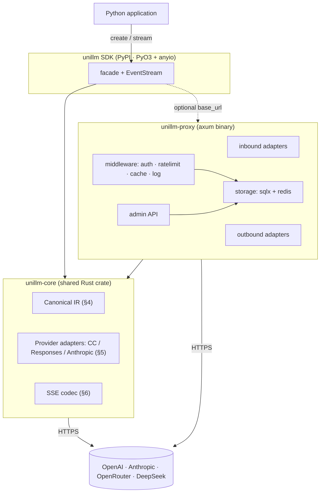

**Explanation:** Two products (`SDK`, `proxy`) sit on top of one shared Rust core, so all
normalization lives in exactly one place. The SDK runs in-process with the Python app and talks to
providers directly by default; it can optionally point `base_url` at the proxy (dashed edge) to gain
keys/routing/caching. The proxy is a standalone process that also uses the core and adds a storage
layer and management API.

### C.2 Non-streaming call — SDK direct (sequence)

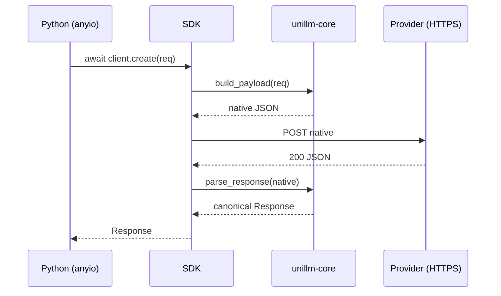

**Explanation:** A non-streaming request is a straight request→response through three pure transforms
(build payload, send, parse response) bookended by the Python facade. All provider-specific shape
lives inside `build_payload` / `parse_response`; the SDK and the caller only ever see canonical types.

### C.3 Streaming call — SDK direct (sequence)

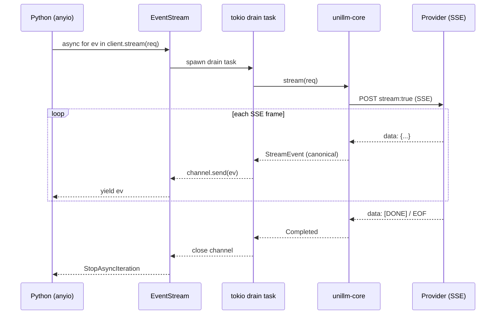

**Explanation:** Streaming decouples production from consumption with a bounded channel. A tokio task
pulls the upstream SSE, decodes it to canonical events, and pushes them into the channel; the
Python `EventStream` async iterator awaits the channel under `anyio` and yields one event at a
time. When the upstream terminates, the core emits `Completed`, the task closes the channel, and
iteration ends.

### C.4 Proxy non-streaming request (sequence)

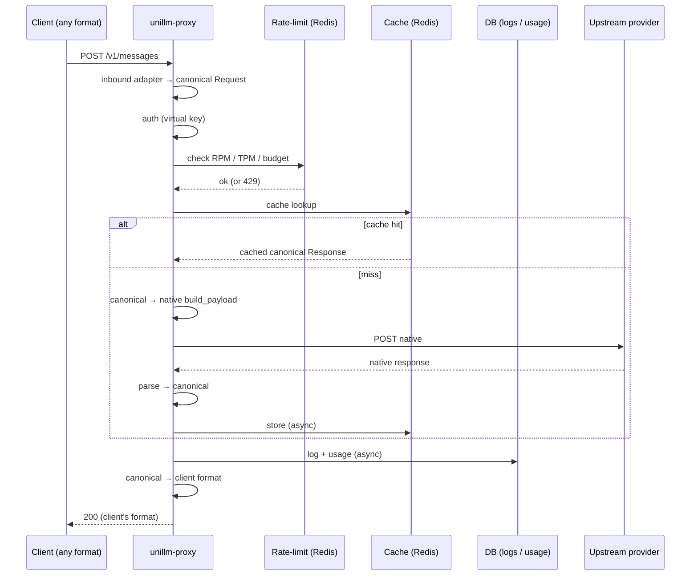

**Explanation:** The proxy is the full gateway. Order is fixed (§10.3): parse → auth → rate-limit →
cache → route/call → cache-store → log → outbound-translate. On a cache hit the upstream is never
called. Logging and cache writes are asynchronous so they never add latency to the critical path.

### C.5 Proxy streaming request (sequence)

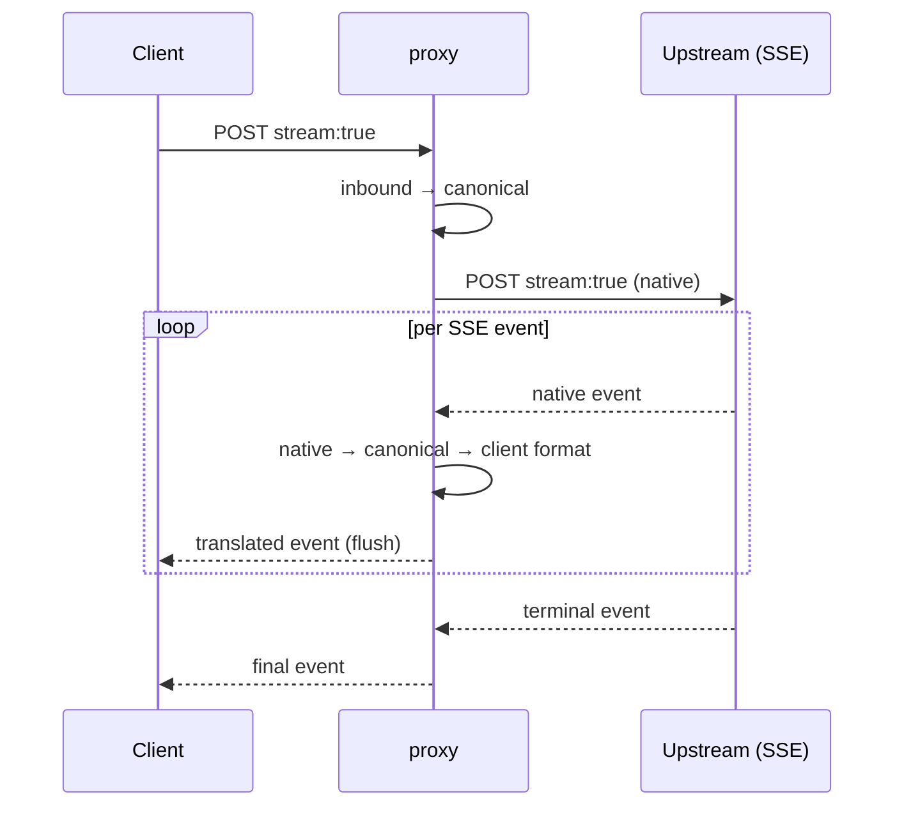

**Explanation:** Streaming is translated event-by-event and flushed immediately — the proxy never buffers
the whole response (except when caching streams is explicitly enabled). This is what lets a
Messages-format client receive a correctly-shaped stream even when the backend is OpenAI CC.

### C.6 Canonical IR type model

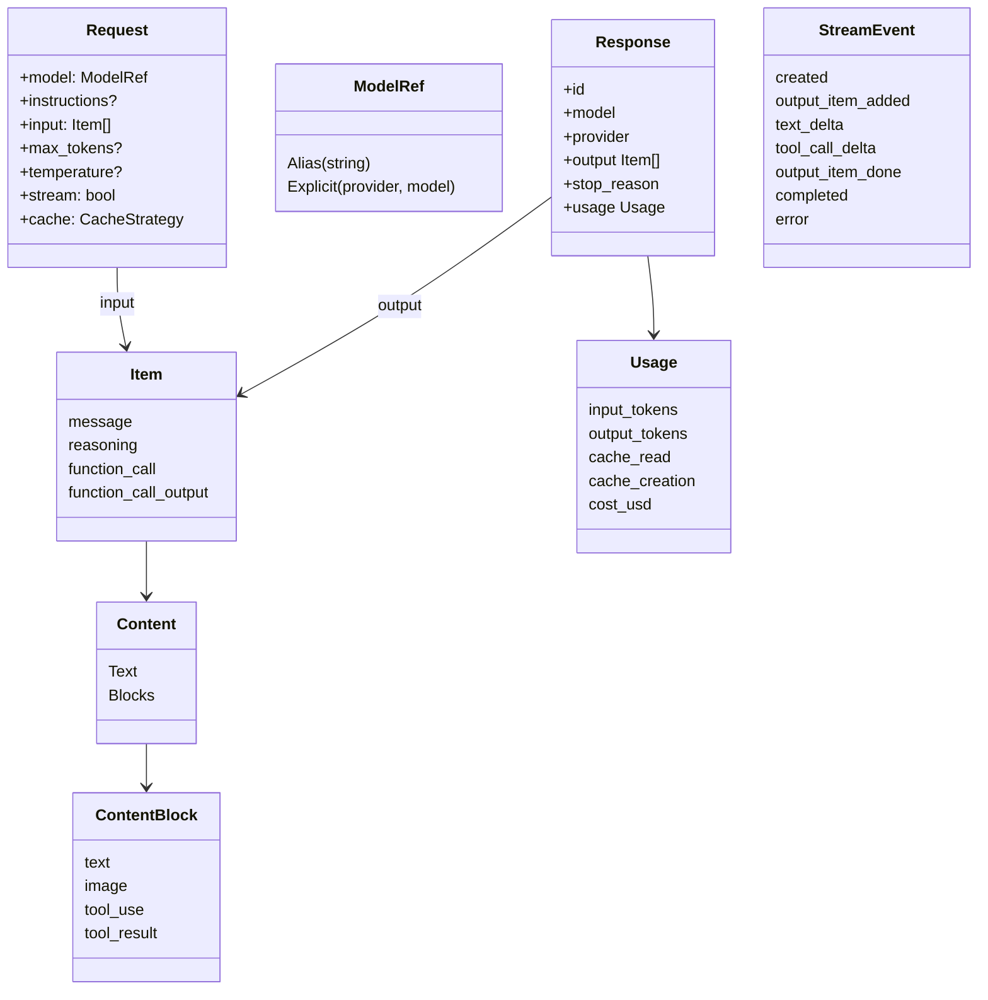

**Explanation:** The whole system is defined by this type graph (§4). `Request` and `Response` share the
same `Item`/`Content`/`ContentBlock` vocabulary, so a response can be fed straight back into the
next request's `input` for multi-turn conversations. `StreamEvent` is the incremental projection of
a `Response`.

### C.7 Dialect / adapter selection

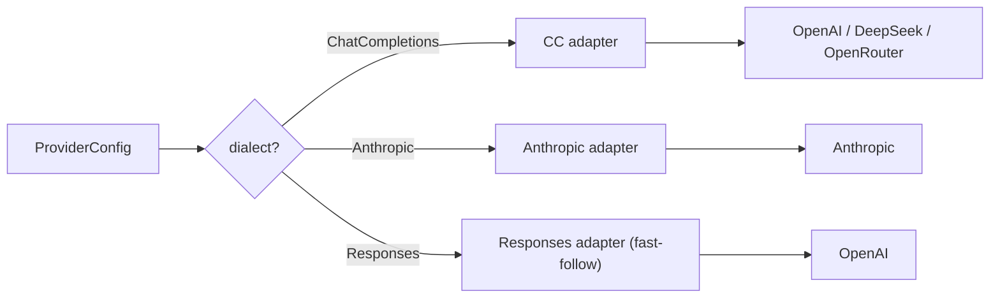

**Explanation:** The factory `build(config)` picks an adapter purely from `dialect` (§5.6). The CC adapter
covers three providers because they share the `/chat/completions` shape; only `base_url`, auth, and
a few headers differ. The Responses dialect is a documented fast-follow — CC already covers OpenAI.

### C.8 Cache-control strategy decision

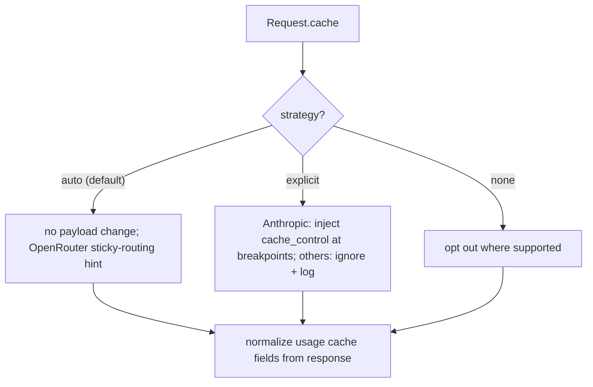

**Explanation:** Cache intent is expressed once, canonically (§7); each provider translates it. Only
Anthropic honors explicit breakpoints; the auto-caching providers still report cache hits, which
the core normalizes into `Usage.cache_read` regardless of strategy.

### C.9 Proxy middleware pipeline (ordered)

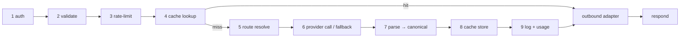

**Explanation:** Middleware order is load-bearing (§10.3). Auth and rate-limit run before any upstream
work; cache lookup short-circuits on hit; cache-store and logging happen after a successful call and
are async. Numbered stages map 1:1 to the proxy's handler chain.

### C.10 PyO3 streaming bridge (channel topology)

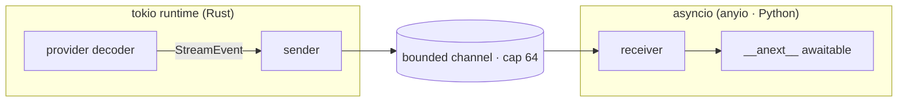

**Explanation:** The hard part of the SDK (§6.6). The Rust side produces canonical events into a bounded
channel; the Python side consumes via `__anext__`. Bounded capacity gives backpressure; dropping
the Python receiver cancels the producer task and closes the upstream connection (no leaks).

### C.11 Storage entity relationships

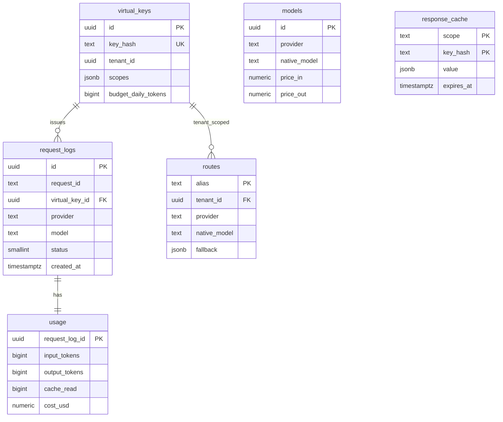

**Explanation:** The data model (§11). `request_logs` is the event spine; `usage` is 1:1 with it and is
where token/cost accounting lives (rolled up into daily/hourly views for admin queries). `models`
and `routes` are config; `response_cache` is independent and keyed by scope+hash. `virtual_keys`
never store the secret — only its hash.

### C.12 Rate-limit decision

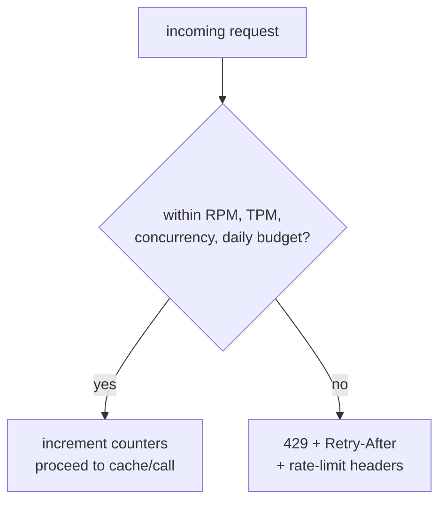

**Explanation:** Four independent dimensions are checked per virtual key (§12). Exceeding any one returns
429 with `Retry-After` and informational headers. If Redis is down, behavior is configurable
(`fail_open`).

### C.13 Tool-use multi-turn

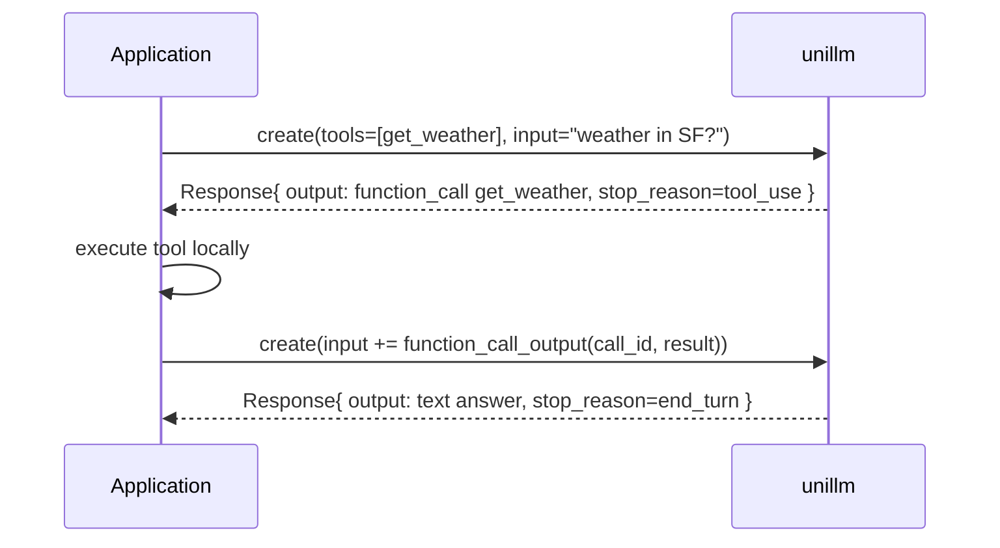

**Explanation:** Tool use is a multi-turn loop (§8) driven entirely by correlating ids: the model's
`function_call.id` ↔ the caller's `function_call_output.call_id`. The caller appends the prior turn
plus the tool result, and retries until `stop_reason != tool_use`.

### C.14 Routing + fallback

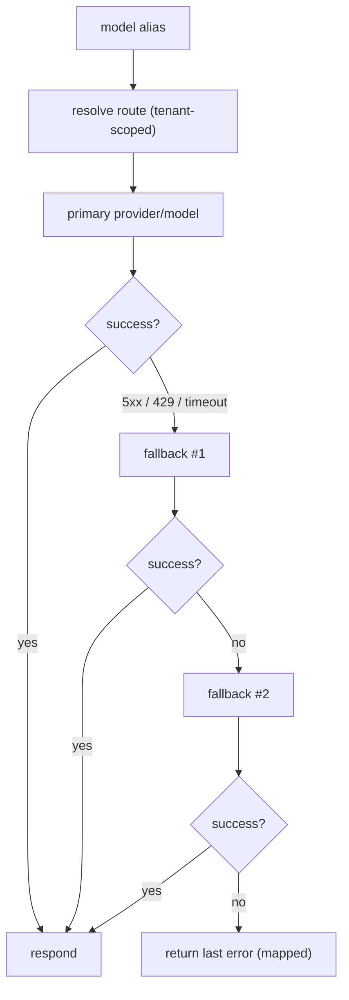

**Explanation:** An alias resolves to an ordered chain (§10.2). Retriable upstream failures (5xx, 429,
timeouts) walk the fallback list; the first success wins; if all fail, the last error is mapped to
a canonical error and returned to the client.
